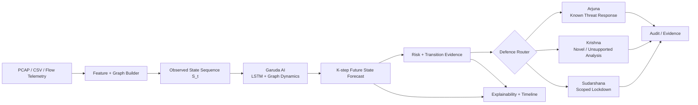

# Krishna Defence System — Garuda AI

> **Smart India Hackathon 2026 · SIH26153**  
> **AI-based Network Attack Forecasting from Network Traffic Data**

[](https://github.com/keshavchauhan15482-byte/defencekrishna/actions/workflows/krishna-integration-ci.yml)
[](https://github.com/keshavchauhan15482-byte/defencekrishna/actions/workflows/v48-unseen-fusion.yml)
[](https://github.com/keshavchauhan15482-byte/defencekrishna/actions/workflows/v52-recovered-timeline.yml)

**Krishna Defence** is an offline-first cyber-defence research prototype that learns evolving network state, forecasts malicious progression before the next observed traffic state, and routes evidence into three defensive lanes:

- **Arjuna** — reviewed known-threat detection and blocking.
- **Krishna** — novel / unsupported threat investigation, evidence retention and learning.
- **Sudarshana** — scoped, operator-approved lockdown controls with expiry and auditability.

The forecasting core, **Garuda AI**, is an autoregressive network-state world-model approximation built around temporal and graph learning. The project is designed around a simple question:

> **Can we move from reacting to an attack after it is obvious to forecasting dangerous network evolution early enough to act?**

---

## Why this project matters

Traditional IDS/WAF pipelines primarily classify what traffic **is now**. SIH26153 asks for something harder: model the evolving network state and forecast what is likely to happen **next**.

Krishna Defence therefore separates four jobs that are often incorrectly collapsed into one score:

1. **Observe** network telemetry and construct time-ordered state representations.
2. **Forecast** future network state over multiple steps.
3. **Estimate risk / progression** from the predicted trajectory.
4. **Respond safely** through reviewed, scoped and auditable controls.

This separation lets the repository report forecasting evidence, unseen-family generalisation, stage/timeline readiness and enforcement readiness independently instead of presenting one inflated “accuracy” number.

---

## System architecture



### Garuda AI in one line

**8 observed network windows → autoregressive future-state rollout → multi-horizon risk evidence → defensive decision support.**

The reference Garuda v3 implementation uses directed graph message passing plus recurrent temporal modelling and an autoregressive decoder. It is intentionally CPU-friendly for an offline SIH demonstration.

---

## Strongest current measured evidence

The current release evidence is indexed in [`RELEASE_EVIDENCE.md`](RELEASE_EVIDENCE.md). The strongest controlled unseen-family result is the frozen **V48 X-IIoTID reserve-family benchmark**.

`exploitation` and `c&c` were excluded from V48 model fitting, calibration, policy selection and fusion-score development. The reserve result was then evaluated across seeds **42 / 43 / 44**.

| Held-out reserve family | Recall mean ± SD | FPR mean ± SD | Precision | F1 | Gate |
|---|---:|---:|---:|---:|---|
| **Exploitation** | **91.88% ± 0.60 pp** | **0.390% ± 0.042 pp** | 97.08% | 94.41% | **PASS 3/3** |
| **Command & Control** | **87.63% ± 2.69 pp** | **0.366%** | 97.02% | 92.08% | **PASS 3/3** |

**Project release gate:** FPR ≤ **1%** and recall ≥ **80%** on every seed, while the validation state model also beats persistence.

The frozen V48 fusion uses:

- 75% known-attack transfer evidence
- 25% world-model transition energy
- 0.25% benign policy budget
- reserve metrics **not used** for score selection

See [`docs/release/V48_RESULTS.md`](docs/release/V48_RESULTS.md) for the full split, leakage controls, frozen configuration hash and invalidated exploratory run history.

### What V48 proves

It supports the controlled claim that a frozen Garuda alert fusion **generalised to two public-dataset attack families excluded from V48 development while meeting the project’s low-FPR / high-recall gate across three seeds**.

It does **not** claim that an undisclosed real-world zero-day has been defeated.

---

## Temporal / early-warning evidence track

V52 adds strict timestamp and provenance machinery for measuring whether a frozen warning occurs **before an independently recorded attack step**.

The current CICAPT development timeline is a commit-pinned third-party recovered copy with an independently corroborated Sandcat event. It is intentionally marked:

- `publisher_verified = false`
- development-grade attack-step timeline evidence
- **not** a verified successful-compromise timestamp
- **not** automatic containment approval

See [`docs/release/V52_CICAPT_TIMELINE.md`](docs/release/V52_CICAPT_TIMELINE.md).

This distinction matters: **forecast horizon ≠ measured lead time**, and **attack-step onset ≠ successful compromise**.

---

# Setup Instructions

## Fastest path — local SIH demo

### Requirements

- **Python 3.10+**; the reference environment is tested on **Python 3.12.14**.
- Internet access is needed only for the first dependency installation.
- The integrated Garuda demo itself runs locally on `127.0.0.1`.

### Windows

Clone the repository, enter it, then run:

```bat
START_LOCAL.bat
```

### macOS / Linux

```bash
./START_LOCAL.command
```

or, on any platform with Python available:

```bash
python3 start_local.py
```

The launcher automatically:

1. creates `.venv` if required;
2. installs `garuda_v3/requirements.txt`;
3. starts `python -m garuda_v3.integrated_server`;
4. waits for the health endpoint;
5. opens the dashboard when healthy.

Open manually if needed:

**http://127.0.0.1:8090**

Runtime logs are written to `garuda_v3/runtime/localhost.log`. Local access credentials are generated under `garuda_v3/runtime/access.json`; the runtime directory is not intended for submission packaging.

---

## Manual setup

```bash
git clone https://github.com/keshavchauhan15482-byte/defencekrishna.git
cd defencekrishna

python3 -m venv .venv
source .venv/bin/activate        # Windows PowerShell: .venv\Scripts\Activate.ps1
python -m pip install --upgrade pip
python -m pip install -r garuda_v3/requirements.txt

python -m garuda_v3.integrated_server
```

Then open:

```text
http://127.0.0.1:8090
```

The Python reference requirements are intentionally small:

- NumPy — inference / numerical model runtime
- scikit-learn — training and evaluation utilities

Node.js is only required for the retained legacy WAF/control-plane runtime and is **not required** to launch the primary integrated Garuda demo.

---

## Smoke-test the local demo

The launcher can verify startup and exit automatically:

```bash
python3 start_local.py --smoke
```

A healthy launch checks both:

```text
http://127.0.0.1:8090/
http://127.0.0.1:8090/health
```

---

## Run the primary regression suite

```bash
OPENBLAS_NUM_THREADS=1 python -m unittest discover -s garuda_v3/tests -v
python ntro-world-model/tests/test_data_integrity.py
python tests/test_proxy_exposure.py
```

For the integrated project contract:

```bash
npm install
npm run test:all
npm run test:v11
npm run test:v15
```

The public GitHub Actions workflows provide the release-facing reproducibility path:

- `.github/workflows/krishna-integration-ci.yml`
- `.github/workflows/v48-unseen-fusion.yml`
- `.github/workflows/v52-cicapt-timeline.yml`
- `.github/workflows/v52-recovered-timeline.yml`

---

## Reproduce the reference Garuda training path

After installing `garuda_v3/requirements.txt`:

```bash
python -m garuda_v3.data \
  ntro-world-model/cicids2018_data/Thursday-01-03-2018_Infiltration.csv \
  --output garuda_v3/artifacts/Thursday.npz

python -m garuda_v3.data \
  ntro-world-model/cicids2018_data/Friday-02-03-2018_Infiltration_REAL.csv \
  --output garuda_v3/artifacts/Friday.npz

OPENBLAS_NUM_THREADS=1 python -m garuda_v3.train \
  --graphs garuda_v3/artifacts/Thursday.npz garuda_v3/artifacts/Friday.npz \
  --epochs 20 \
  --seed 42 \
  --decoder residual \
  --output garuda_v3/artifacts/reproduced
```

Then serve the reproduced checkpoint with:

```bash
python -m garuda_v3.server --artifacts garuda_v3/artifacts/reproduced
```

Use a new output directory instead of overwriting published artifacts. See [`garuda_v3/V3_README.md`](garuda_v3/V3_README.md) for the model card, schema rules and evaluation interpretation.

---

## Demo flow for judges

A clean nationals demonstration can be shown in this order:

1. **Live / recorded network state** — show observed telemetry and the current graph/state representation.
2. **Garuda forecast** — show the next-state trajectory and risk evolution rather than only a static class label.
3. **Explainability** — show which observed features drove the forecast.
4. **Unknown-family evidence** — present the frozen V48 reserve benchmark and its low FPR.
5. **Defence routing** — explain Arjuna / Krishna / Sudarshana and why forecast confidence does not automatically authorize containment.
6. **Evidence discipline** — show that failed historical experiments remain archived instead of being hidden.

For presentation numbers, always use [`RELEASE_EVIDENCE.md`](RELEASE_EVIDENCE.md) as the authoritative index.

---

## Repository map

| Path | Purpose |
|---|---|
| `garuda_v3/` | Forecasting models, inference, training, evaluation, artifacts and tests |
| `datasets/` | Dataset provenance, manifests, prepared data and recovered evidence |
| `docs/release/` | Current release-facing V48 / V52 evidence |
| `docs/archive/` | Superseded, exploratory and failed research retained for auditability |
| `sih_submission/` | SIH architecture, demo and submission material |
| `security_validation/` | Defensive validation material |
| `.github/workflows/` | Current reproducibility and release CI |
| `proxy.js` + root JS modules | Retained WAF/control runtime used by legacy / defensive integration paths |

---

## Engineering principles

Krishna Defence follows a few fail-closed evidence rules:

- Unknown labels are not silently converted to benign labels.
- Final reserve families are not used for threshold or fusion selection.
- Forecasting quality and attack-warning quality are reported separately.
- Failed experiments remain auditable under `docs/archive/`.
- GNN superiority over LSTM is not claimed where it was not demonstrated.
- Timeline annotations are evaluation evidence, never runtime model features.
- Automatic containment is not approved merely because forecast confidence is high.

These constraints make the numbers less flashy, but substantially more defensible.

---

## Current limitations

This repository is a strong **research / SIH prototype**, not a certified production IPS.

Open evidence and deployment gates include:

- publisher-authenticated attack timelines and verified successful-compromise timestamps;
- more independent, previously unseen campaigns with clean pre-event histories;
- fully supervised and externally validated MITRE stage progression;
- endpoint-preserving / packet-derived training at broader scale;
- production identity, TLS, tenant isolation, protected model signing and external audit;
- independent security review and customer-network integration.

The project therefore uses the term **autoregressive state-dynamics world-model approximation** rather than claiming a fully causal world model.

---

## Evidence & documentation

- **Release evidence index:** [`RELEASE_EVIDENCE.md`](RELEASE_EVIDENCE.md)
- **V48 unseen-family results:** [`docs/release/V48_RESULTS.md`](docs/release/V48_RESULTS.md)
- **V52 timeline / lead-time evidence:** [`docs/release/V52_CICAPT_TIMELINE.md`](docs/release/V52_CICAPT_TIMELINE.md)
- **Garuda model card / developer guide:** [`garuda_v3/V3_README.md`](garuda_v3/V3_README.md)
- **Historical research record:** [`docs/archive/`](docs/archive/)

---

## Responsible use

Krishna Defence is intended for defensive cybersecurity research, owned-lab testing and authorized network protection. Do not use the project to attack systems you do not own or have explicit permission to test.

---

### SIH26153 · Krishna Defence System

**Forecast the network state. Detect dangerous progression early. Respond with evidence, not guesswork.**
