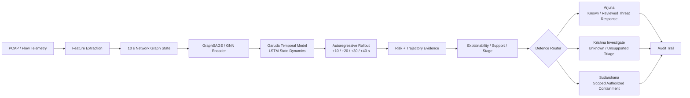

# Krishna Defence System — Garuda AI

> **Smart India Hackathon 2026 · SIH26153**  
> **Forecast-first cyber defence using network-state world modelling**

[](https://github.com/keshavchauhan15482-byte/defencekrishna/actions/workflows/krishna-integration-ci.yml)

**Krishna Defence System** is an offline-first SIH research prototype that models evolving network behaviour, forecasts future network state over multiple horizons, and turns those predicted trajectories into explainable risk evidence for defensive decision support.

It is designed to answer one question:

> **Can we see dangerous network evolution before a conventional reactive IDS would only label the present traffic?**

---

## Evaluator quick path

If you are reviewing this repository for SIH, use this order:

1. **Run the main demo** — follow [Quick Setup](#quick-setup--main-demo).
2. **See the architecture** — read [System Architecture](#system-architecture).
3. **Check the strongest verified results** — open [`docs/release/FINAL_SIH_EVIDENCE.md`](docs/release/FINAL_SIH_EVIDENCE.md).
4. **Inspect the forecasting implementation** — open [`garuda_v3/`](garuda_v3/).
5. **See the complete document map** — open [`docs/README.md`](docs/README.md).

The front-facing SIH dashboard is **`console.html`**, served through the local main-console bridge on port **8091** and connected to the Garuda inference engine on port **8090**.

---

## What makes Krishna different?

| Traditional IDS / classifier | Krishna Defence / Garuda AI |
|---|---|
| Classifies current traffic | Models how network state evolves |
| Per-flow or per-window reaction | Multi-step future-state rollout |
| Primarily reactive | Forecast-first decision support |
| One score can hide uncertainty | Forecast, support, stage and response evidence are separated |
| Often cloud/service dependent | Primary SIH demo runs locally |

The system deliberately keeps **forecasting quality**, **attack-warning evidence**, **stage evidence**, **runtime support**, and **response authorization** as separate claim lanes.

---

## System architecture


```mermaid
flowchart LR
    A[PCAP / Flow Telemetry] --> B[Feature Extraction]
    B --> C[10 s Network Graph State]
    C --> D[GraphSAGE / GNN Encoder]
    D --> E[Garuda Temporal Model\nLSTM State Dynamics]
    E --> F[Autoregressive Rollout\n+10 / +20 / +30 / +40 s]
    F --> G[Risk + Trajectory Evidence]
    G --> H[Explainability / Support / Stage]
    H --> I{Defence Router}
    I --> J[Arjuna\nKnown / Reviewed Threat Response]
    I --> K[Krishna Investigate\nUnknown / Unsupported Triage]
    I --> L[Sudarshana\nScoped Authorized Containment]
    J --> M[Audit Trail]
    K --> M
    L --> M
```

### Garuda AI in one line

**Observed network history → graph-aware temporal state model → K-step future-state rollout → explainable risk evidence → controlled defence routing.**

### Main runtime contract

- **Snapshot interval:** 10 seconds
- **Observed context:** up to ~80 seconds
- **Forecast horizons:** +10 / +20 / +30 / +40 seconds
- **Inputs:** flow-level and packet-derived network telemetry
- **Primary runtime:** local CPU-friendly Python / NumPy reference implementation
- **UI:** premium evaluator dashboard in `console.html`

---

## Defence stack

| Component | Role |
|---|---|
| **Garuda AI** | Forecasts future network state and risk trajectory |
| **Arjuna** | Response path for validated known / reviewed attack evidence |
| **Krishna Investigate** | Unknown or unsupported-threat triage, evidence retention and controlled learning |
| **Sudarshana** | Scoped, explicitly authorized quarantine / lockdown controls |

> **Naming note:** *Krishna Defence System* is the complete platform. *Krishna Investigate* is the unknown-threat investigation lane inside that platform.

---

## Strongest current verified evidence

The judge-facing source of truth is [`docs/release/FINAL_SIH_EVIDENCE.md`](docs/release/FINAL_SIH_EVIDENCE.md). Results from different datasets are **not blended into one synthetic score**.

| Evidence lane | Verified result | Meaning |
|---|---:|---|
| **CICAPT-IIoT2024 state forecasting** | **~27.5% lower state MSE than persistence** across 3 seeds | Learned future-state dynamics beat a persistence baseline in this experiment |
| **UNSW-NB15 independent-source replication** | **~98.7% recall**, **~0.29% FPR**, **~94.8% F1** | High recall with low false-positive rate on the frozen same-input protocol |
| **Same-input Logistic Regression baseline** | 100% recall, **~11.65% FPR** | LR had higher recall but substantially more false positives |
| **Compatible CPU runtime** | **~2.9–3.0 ms** mean forecast latency | In-process lab benchmark for the compatible local checkpoint |
| **Runtime safety** | **21 focused + 188 full Garuda tests passed** | Unsupported / unverified runtime support fails closed into advisory mode |

### Important evidence boundaries

- The project does **not** claim 100% accuracy or universal zero-day detection.
- Current runtime support can be `UNVERIFIED_RUNTIME_SUPPORT / SHADOW_UNRESOLVED`; unsupported inputs are not silently promoted to confident automated action.
- Current timing evidence measures lead to **labelled attack-step onset**, not verified successful compromise.
- Robust unseen-subtype MITRE-stage progression is **not yet release-supported**.
- Automatic enterprise containment is not claimed from forecast confidence alone.

These boundaries are intentional: the project prefers reproducible evidence over inflated claims.

---

# Quick Setup — Main Demo

## Requirements

- **Python 3.10+**
- Reference environment: **Python 3.12.14**
- Around 1 GB free disk space is recommended for the virtual environment, dependencies and runtime artifacts.
- Internet is needed on the **first run** if Python packages are not already cached. After setup, the primary demo runs locally.
- **Node.js is not required** for the primary Garuda + main-console demo.

Python dependencies are intentionally small and pinned in [`garuda_v3/requirements.txt`](garuda_v3/requirements.txt): NumPy, scikit-learn, pandas and pytest.

## 1. Clone the repository

```bash
git clone https://github.com/keshavchauhan15482-byte/defencekrishna.git
cd defencekrishna
```

## 2. Start the main SIH console

### macOS / Linux

```bash
./START_LOCAL.command
```

If execute permission is missing:

```bash
chmod +x START_LOCAL.command
./START_LOCAL.command
```

### Windows

Double-click:

```text
START_LOCAL.bat
```

or run it from Command Prompt / PowerShell:

```bat
START_LOCAL.bat
```

### Cross-platform Python fallback

```bash
python3 start_main_console.py
```

On Windows, if `python3` is unavailable:

```bat
py -3 start_main_console.py
```

## 3. Open the evaluator dashboard

The launcher opens the browser automatically. If needed, open:

```text
http://127.0.0.1:8091/console.html
```

Expected services:

| Service | Address | Purpose |
|---|---|---|
| **Main SIH console** | `http://127.0.0.1:8091/console.html` | Premium evaluator-facing dashboard |
| **Garuda engine** | `http://127.0.0.1:8090` | Local inference / analysis backend |
| **Engine health** | `http://127.0.0.1:8090/health` | Runtime health check |
| **Console health** | `http://127.0.0.1:8091/health` | Main-console build / bridge health |

Current main-console build identity: **`v132-nationals-console`**.

Keep the launcher terminal open while using the demo. Press **Ctrl+C** to stop both services.

---

## What the launcher does automatically

`start_main_console.py`:

1. checks whether ports **8090 / 8091** are already occupied;
2. creates `.venv` when needed;
3. installs / validates `garuda_v3/requirements.txt`;
4. starts the Garuda integrated engine on **8090**;
5. starts the premium `console.html` bridge on **8091**;
6. waits for both health endpoints;
7. verifies the expected main-console build;
8. opens the correct evaluator dashboard.

Runtime logs are written under:

```text
garuda_v3/runtime/
```

---

## 60-second demo check

After the page opens, verify these four things before presenting:

1. Header shows **`V132 · NATIONALS CONSOLE`**.
2. Threat trajectory / live counters are moving and backend status is healthy.
3. Offline telemetry analysis can call the local bridge and return forecast cards.
4. Architecture, MITRE progression, explainability, benchmark and enterprise/CII sections are visible on the same `console.html` page.

For the actual 2-minute presentation flow, see [`sih_submission/DEMO_SCRIPT.md`](sih_submission/DEMO_SCRIPT.md).

---

## Troubleshooting

### “An older/different localhost service is using 8090/8091”

An old server is still running. Stop the previous terminal/process, then launch again.

macOS / Linux quick check:

```bash
lsof -i :8090
lsof -i :8091
```

Windows quick check:

```bat
netstat -ano | findstr :8090
netstat -ano | findstr :8091
```

### Browser still shows an older UI

Stop the existing server, pull the latest branch, relaunch, then hard-refresh the page.

```bash
git pull
./START_LOCAL.command
```

### Dependency installation fails

Verify Python first:

```bash
python3 --version
```

Then install manually if required:

```bash
python3 -m venv .venv
source .venv/bin/activate
python -m pip install --upgrade pip
python -m pip install -r garuda_v3/requirements.txt
python start_main_console.py
```

Windows activation:

```bat
.venv\Scripts\activate
python -m pip install --upgrade pip
python -m pip install -r garuda_v3\requirements.txt
python start_main_console.py
```

### Need logs

Check:

```text
garuda_v3/runtime/localhost.log
garuda_v3/runtime/main_console.log
```

---

## Repository map

The repository is intentionally split into a small evaluator path and deeper engineering / audit material.

| Path | What is here | Evaluator priority |
|---|---|---|
| `README.md` | Start here: project story + setup | **Start here** |
| `console.html` | Main premium SIH dashboard | **High** |
| `garuda_v3/` | Current forecasting, inference, training, evaluation and runtime code | **High** |
| `docs/release/FINAL_SIH_EVIDENCE.md` | Authoritative current evidence / claim boundaries | **High** |
| `RELEASE_EVIDENCE.md` | Short evidence index | High |
| `sih_submission/` | Submission / demo material | High |
| `datasets/` | Dataset provenance, prepared data and manifests | Engineering |
| `tests/` + `garuda_v3/tests/` | Regression / integration validation | Engineering |
| `security_validation/` | Defensive validation evidence | Engineering |
| `.github/workflows/` | Reproducibility and experiment CI | Engineering |
| `docs/archive/` | Historical / failed / superseded experiments kept for auditability | Archive |
| root JS modules | Earlier defence-stack / WAF integration path retained for compatibility and research history | Advanced |

For a cleaner documentation index, see [`docs/README.md`](docs/README.md).

---

## Run the core regression tests

Primary Python/Garuda suite:

```bash
OPENBLAS_NUM_THREADS=1 python -m unittest discover -s garuda_v3/tests -v
```

Additional repository checks:

```bash
python ntro-world-model/tests/test_data_integrity.py
python tests/test_proxy_exposure.py
```

The broader retained defence-stack test path requires Node.js:

```bash
npm install
npm run test:all
```

Node is optional for the primary SIH demo but required for the retained legacy/control-plane JS suite.

---

## Reproduce the reference Garuda training path

Create prepared graph data:

```bash
python -m garuda_v3.data \
  ntro-world-model/cicids2018_data/Thursday-01-03-2018_Infiltration.csv \
  --output garuda_v3/artifacts/Thursday.npz

python -m garuda_v3.data \
  ntro-world-model/cicids2018_data/Friday-02-03-2018_Infiltration_REAL.csv \
  --output garuda_v3/artifacts/Friday.npz
```

Train into a **new** output directory:

```bash
OPENBLAS_NUM_THREADS=1 python -m garuda_v3.train \
  --graphs garuda_v3/artifacts/Thursday.npz garuda_v3/artifacts/Friday.npz \
  --epochs 20 \
  --seed 42 \
  --decoder residual \
  --output garuda_v3/artifacts/reproduced
```

Do not overwrite published evidence artifacts when reproducing experiments.

---

## Engineering principles

Krishna Defence uses fail-closed evidence rules:

- Unknown labels are not silently converted to benign.
- Test / reserve evidence is not used for validation threshold fitting.
- Forecasting, warning, stage and containment claims are reported separately.
- Unsupported telemetry is advisory / shadow-mode rather than force-fit into a confident claim.
- GNN superiority is not claimed where the measured evidence does not demonstrate it.
- Failed external-domain experiments remain preserved in the evidence record.
- Forecast confidence alone does not authorize autonomous containment.

---

## Current scope

This is a **research / SIH prototype**, not a certified production IPS.

The strongest demonstrated value is the combination of:

**forecast-first architecture + learned state-dynamics evidence + low-FPR independent-source replication + millisecond-scale compatible inference + explainability + layered response + explicit uncertainty governance.**

Remaining research gates include broader cross-domain portability, robust unseen-subtype stage progression, verified successful-compromise timestamps for true pre-compromise evidence, and production-grade identity/TLS/tenant isolation/external security review.

---

## Responsible use

This repository is intended for **defensive cybersecurity research, owned-lab testing and explicitly authorized network protection**. Do not use it to attack systems you do not own or have permission to test.

---

### SIH26153 · Krishna Defence System

**See the threat before the impact — with evidence, not guesswork.**
