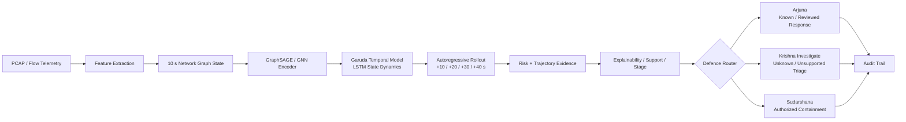

<div align="center">

# Krishna Defence System
### Garuda AI · Forecast-First Cyber Defence

**Smart India Hackathon 2026 · SIH26153**  
*AI-based Network Attack Forecasting from Network Traffic Data*


**See the threat before the impact — with evidence, not guesswork.**

</div>

---

## Evaluator: start here

| In 60 seconds | Open |
|---|---|
| **Run the main demo** | [Quick Setup](#quick-setup--main-demo) |
| **Understand the system** | [Architecture](#system-architecture) |
| **Check verified results** | [`docs/release/FINAL_SIH_EVIDENCE.md`](docs/release/FINAL_SIH_EVIDENCE.md) |
| **Inspect the forecasting code** | [`garuda_v3/`](garuda_v3/) |
| **See all documentation** | [`docs/README.md`](docs/README.md) |

> **Unified evaluator surface + Garuda backend:** `http://127.0.0.1:8090/console.html` (one process, one port).

---

## What is Krishna Defence?

**Krishna Defence System** is an offline-first SIH research prototype that learns evolving network behaviour, forecasts future network state over multiple horizons, and converts those predicted trajectories into explainable risk evidence for defensive decision support.

Traditional IDS/WAF systems mainly answer **“What is happening now?”**. Garuda AI is built around a harder question:

> **“Given the network state we have observed, what is likely to happen next?”**

The platform separates forecasting, evidence, investigation and containment so one score never hides uncertainty.

### Defence stack

| Component | Responsibility |
|---|---|
| **Garuda AI** | Forecasts future network state and risk trajectory |
| **Arjuna** | Known / reviewed threat-response path |
| **Krishna Investigate** | Unknown or unsupported-signal triage and evidence retention |
| **Sudarshana** | Scoped, explicitly authorized quarantine / lockdown controls |

> **Naming note:** *Krishna Defence System* is the complete platform. *Krishna Investigate* is one internal response lane.

---

## Why this is not a traditional IDS

| Traditional IDS / classifier | Krishna Defence / Garuda AI |
|---|---|
| Classifies current traffic | Models network-state evolution |
| Per-flow / per-window reaction | Multi-step future-state rollout |
| Primarily reactive | Forecast-first decision support |
| One score may hide uncertainty | Forecast, support, stage and response evidence are separated |
| Often service/cloud dependent | Primary SIH demo runs locally |

---

## System Architecture


```mermaid
flowchart LR
    A[PCAP / Flow Telemetry] --> B[Feature Extraction]
    B --> C[10 s Network Graph State]
    C --> D[GraphSAGE / GNN Encoder]
    D --> E[Garuda Temporal Model\nLSTM State Dynamics]
    E --> F[Autoregressive Rollout\n+10 / +20 / +30 / +40 s]
    F --> G[Risk + Trajectory Evidence]
    G --> H[Explainability / Support / Stage]
    H --> I{Defence Router}
    I --> J[Arjuna\nKnown / Reviewed Response]
    I --> K[Krishna Investigate\nUnknown / Unsupported Triage]
    I --> L[Sudarshana\nAuthorized Containment]
    J --> M[Audit Trail]
    K --> M
    L --> M
```

**Garuda in one line:**  
**Observed history → graph-aware temporal state model → K-step future-state rollout → explainable risk evidence → controlled defence routing.**

### Runtime contract

| Item | Current demo contract |
|---|---|
| Snapshot interval | **10 seconds** |
| Observed context | **up to ~80 seconds** |
| Forecast horizons | **+10 / +20 / +30 / +40 seconds** |
| Inputs | Flow-level + packet-derived telemetry |
| Runtime | Local CPU-friendly Python / NumPy reference implementation |
| Frontend | Premium evaluator console in `console.html` |

---

## Strongest verified evidence

The authoritative judge-facing evidence is [`docs/release/FINAL_SIH_EVIDENCE.md`](docs/release/FINAL_SIH_EVIDENCE.md). Results from different datasets/protocols are intentionally **not blended into one synthetic accuracy number**.

| Evidence lane | Verified result | What it supports |
|---|---:|---|
| **CICAPT-IIoT2024 state forecasting** | **~27.5% lower state MSE than persistence** across 3 seeds | Learned future-state dynamics beat persistence in that experiment |
| **UNSW-NB15 independent-source replication** | **~98.7% recall · ~0.29% FPR · ~94.8% F1** | High recall with low false-positive rate under the frozen same-input protocol |
| **Same-input Logistic Regression** | 100% recall · **~11.65% FPR** | Baseline had higher recall but far more false positives |
| **Compatible CPU runtime** | **~2.9–3.0 ms mean forecast latency** | In-process lab runtime for the compatible checkpoint |
| **Runtime safety** | **21 focused + 188 full Garuda tests passed** | Unsupported / unverified runtime support fails closed into advisory mode |

### Evidence boundaries

- No claim of **100% accuracy** or a **universal zero-day detector**.
- Current timing evidence is lead to **labelled attack-step onset**, not verified successful compromise.
- Robust unseen-subtype MITRE-stage progression is **not yet release-supported**.
- Unsupported runtime inputs remain advisory / shadow-mode rather than forcing a confident stage or autonomous response.
- Forecast confidence alone does **not** authorize enterprise containment.

This evidence discipline is intentional: **failed and negative experiments remain visible instead of being hidden.**

---

# Quick Setup — Main Demo

## Requirements

- **Python 3.10+** — reference environment: **Python 3.12.14**
- Internet only on first run if Python packages are not already cached
- Roughly **1 GB** free disk space recommended for the virtual environment and runtime artifacts
- **Node.js is not required** for the primary Garuda + main-console demo

Pinned Python dependencies are in [`garuda_v3/requirements.txt`](garuda_v3/requirements.txt): **NumPy, scikit-learn, pandas, pytest**.

### 1) Clone

```bash
git clone https://github.com/keshavchauhan15482-byte/defencekrishna.git
cd defencekrishna
```

### 2) Start

**macOS / Linux**

```bash
./START_LOCAL.command
```

If execute permission is missing:

```bash
chmod +x START_LOCAL.command
./START_LOCAL.command
```

**Windows**

```bat
START_LOCAL.bat
```

**Cross-platform fallback**

```bash
python3 start_main_console.py
```

Windows fallback:

```bat
py -3 start_main_console.py
```

### 3) Open

The launcher opens the browser automatically. If needed:

| Service | Address |
|---|---|
| **Main SIH console** | `http://127.0.0.1:8090/console.html` |
| **Garuda engine** | `http://127.0.0.1:8090` |
| **Engine health** | `http://127.0.0.1:8090/health` |
| **Console health** | `http://127.0.0.1:8090/health` |

Current evaluator-console build identity: **`v132-nationals-console`**.

Keep the launcher terminal open while presenting. Press **Ctrl+C** to stop both local services.

---

## What the launcher does

`start_main_console.py` automatically:

1. checks ports **8090 / 8091**;
2. creates `.venv` when required;
3. installs / validates `garuda_v3/requirements.txt`;
4. starts the Garuda engine on **8090**;
5. starts the main `console.html` bridge on **8091**;
6. checks both health endpoints;
7. verifies the expected console build;
8. opens the evaluator dashboard.

Runtime logs are written under `garuda_v3/runtime/`.

---

## 60-second pre-demo check

Before recording or presenting, verify:

- Header shows **`V132 · NATIONALS CONSOLE`**.
- Runtime status is connected and live counters / threat trajectory are updating.
- CSV / PCAP analysis reaches the local backend and returns forecast cards.
- Architecture, forecast proof, MITRE rail, explainability, benchmarks and enterprise/CII sections are visible on the same page.

Presentation flow: [`sih_submission/DEMO_SCRIPT.md`](sih_submission/DEMO_SCRIPT.md)

---

## Repository map

| Path | Purpose | Priority |
|---|---|---|
| `README.md` | Project overview + setup | **START HERE** |
| `console.html` | Main premium SIH dashboard | **HIGH** |
| `garuda_v3/` | Forecasting, inference, training, evaluation, runtime | **HIGH** |
| `docs/release/FINAL_SIH_EVIDENCE.md` | Current claim/evidence source of truth | **HIGH** |
| `RELEASE_EVIDENCE.md` | Short evidence index | High |
| `sih_submission/` | SIH architecture and demo material | High |
| `datasets/` | Dataset provenance / manifests / prepared data | Engineering |
| `garuda_v3/tests/` + `tests/` | Regression and integration validation | Engineering |
| `security_validation/` | Defensive validation material | Engineering |
| `.github/workflows/` | Reproducibility / experiment CI | Engineering |
| `docs/archive/` | Historical, superseded and failed experiments retained for audit | Archive |
| Root JS modules | Earlier defence-stack / WAF integration path | Advanced |

For the documentation index, open [`docs/README.md`](docs/README.md).

---

<details>
<summary><strong>Advanced: troubleshooting</strong></summary>

### Ports 8090 / 8091 already in use

Stop the old local server and relaunch.

macOS / Linux:

```bash
lsof -i :8090
lsof -i :8091
```

Windows:

```bat
netstat -ano | findstr :8090
netstat -ano | findstr :8091
```

### Browser shows an older UI

```bash
git pull
./START_LOCAL.command
```

Then hard-refresh the browser.

### Manual dependency setup

```bash
python3 -m venv .venv
source .venv/bin/activate
python -m pip install --upgrade pip
python -m pip install -r garuda_v3/requirements.txt
python start_main_console.py
```

Windows activation:

```bat
.venv\Scripts\activate
python -m pip install --upgrade pip
python -m pip install -r garuda_v3\requirements.txt
python start_main_console.py
```

Logs:

```text
garuda_v3/runtime/localhost.log
garuda_v3/runtime/main_console.log
```

</details>

<details>
<summary><strong>Advanced: tests and reproducibility</strong></summary>

Primary Garuda regression suite:

```bash
OPENBLAS_NUM_THREADS=1 python -m unittest discover -s garuda_v3/tests -v
```

Additional checks:

```bash
python ntro-world-model/tests/test_data_integrity.py
python tests/test_proxy_exposure.py
```

The retained JS/control-plane suite requires Node.js:

```bash
npm install
npm run test:all
```

Reference training path:

```bash
python -m garuda_v3.data \
  ntro-world-model/cicids2018_data/Thursday-01-03-2018_Infiltration.csv \
  --output garuda_v3/artifacts/Thursday.npz

python -m garuda_v3.data \
  ntro-world-model/cicids2018_data/Friday-02-03-2018_Infiltration_REAL.csv \
  --output garuda_v3/artifacts/Friday.npz

OPENBLAS_NUM_THREADS=1 python -m garuda_v3.train \
  --graphs garuda_v3/artifacts/Thursday.npz garuda_v3/artifacts/Friday.npz \
  --epochs 20 \
  --seed 42 \
  --decoder residual \
  --output garuda_v3/artifacts/reproduced
```

Use a **new output directory**; do not overwrite published evidence artifacts.

</details>

---

## Current scope

Krishna Defence is a **research / SIH prototype**, not a certified production IPS.

The strongest demonstrated combination today is:

**forecast-first architecture + learned state-dynamics evidence + low-FPR independent-source replication + millisecond-scale compatible inference + explainability + layered response + explicit uncertainty governance.**

Remaining research gates include broader cross-domain portability, robust unseen-subtype progression, verified successful-compromise timestamps for true pre-compromise evidence, and production-grade identity / TLS / tenant isolation / external security review.

---

## Responsible use

This repository is intended for **defensive cybersecurity research, owned-lab testing and explicitly authorized network protection**. Do not use it to attack systems you do not own or have permission to test.

---

<div align="center">

### SIH26153 · Krishna Defence System
**Forecast the network state. Explain the trajectory. Respond with evidence.**

</div>

## Audited runtime fixes

See [the audit and limits](docs/release/audit_runtime_fixes/README.md). Prepare the bundled captures before uploading; original malformed recordings remain strict-parser inputs, not clean telemetry:

```bash
python -m garuda_v3.pcap_packaging --output-dir datasets/ids2018/prepared
python start_local.py
```

The prepared files retain original packet bytes and remove whole contaminated/terminal 10-second windows. Upload them to the charcoal/orange console. The latest packet model's state trajectory is displayed separately from the legacy risk trajectory.
