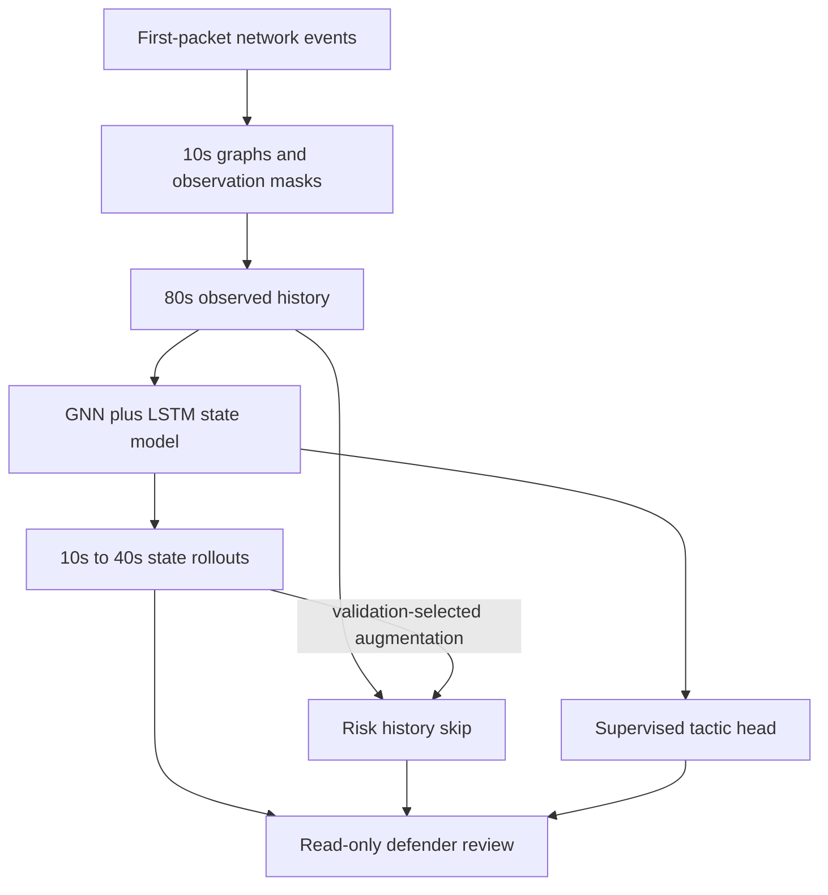

# Connection-start forecasting and the risk-compression fix

This change adds a causally restricted event representation, six trained state
backbones, four-horizon risk skip heads, two frozen evaluations and an authenticated
shadow endpoint on the existing console/backend port. The original packet-state
bundle and earlier diagnostic remain intact. Readouts do not publish policies.

## What the audit found and changed

1. A finished connection's bytes, packets, duration, service identification and
   history can contain information unavailable at its start. The new 19-feature
   path uses only first-packet timestamp, endpoints and transport. It reconstructs
   events retrospectively from publisher logs. Symmetric endpoints prevent Zeek's
   later originator/responder flip from leaking future orientation decisions.
2. Demanding twelve fully observed buckets excluded most sparse attack traffic.
   Gaps now carry explicit unknown labels and zero observation masks. Eligible
   origins require at least four of eight observed history buckets, an observed
   origin and at least one observed future bucket. Future-state loss, persistence
   comparisons and metrics exclude unobserved targets. Gaps are never benign.
3. Original weekly partitions overlap UTC dates near 06:00 boundaries. Declared
   half-open UTC calendar weeks now filter both attack and matched benign records.
   The original development-only rejection is preserved in
   [`development_rejection.log`](development_rejection.log). No test records were
   parsed or model trained in that rejected attempt.
4. The state model retained useful dynamics but its compressed risk head lost the
   attack signal. A regularized **observed-history skip** protects that information.
   A second readout also receives learned future states and residual trajectories.
   Validation selects augmentation only when Brier improves and F1 is no worse.
   **All final selections chose history skip.** This fixes the compressed-head
   diagnostic, but does not establish incremental risk value from learned rollouts.
5. Calibration, per-horizon thresholds and the actual combined any-horizon alert
   threshold use validation only. All seeds and unsuccessful/unsupported gates
   stay in the reports. Checkpoint hashes and pre-test policy freezes are checked
   when loading the readout. Unsupported tactics display insufficient evidence.



## Study 1: fresh connection-start diagnostic

[`protocol.json`](protocol.json) reserved all four UWF-ZeekDataSum25-2 weekly files
before decoding. Native development labels come from UWF-ZeekData22, UWF-ZeekData24
and UWF-ZeekDataFall24-2. Sources and corresponding publisher benign exports are
hash-pinned. Train/validation/final observation dates are disjoint. State learning
precedes readout learning, which cannot modify the state backbone.

The final release yielded **58,625 eligible sequences across nine source days**:
142 any-horizon positive origins, 58,474 negative origins and nine unknown origins.
There are 142 positive targets per individual horizon; these are overlapping
sequence targets, not 142 independent incidents. Entire unusable shards are audited.

| Model, seeds 42/43/44 | State MSE improvement over persistence | Positive paired state gates | Original compressed-head any-horizon recall |
|---|---:|---:|---:|
| LSTM | 12.19% ± 1.90 percentage points | 3/3 | 0% |
| GNN+LSTM | 8.44% ± 3.57 percentage points | 3/3 | 0.235% mean |

Each state comparison has a paired source-day bootstrap interval above zero.
Seed SD is not an incident confidence interval. Wilson intervals in risk tables
treat sequence targets as Bernoulli trials and do not correct their correlation.
The equal-history logistic baseline had 100% recall and 0.236–0.309% FPR across
horizons. This exposed the compression bottleneck rather than a lack of observable
signal. The complete unsuccessful compressed-head experiment is preserved:

- [Report](../../../garuda_v3/artifacts/connection_start/compressed_diagnostic/report.json)
- [Pre-test freeze](../../../garuda_v3/artifacts/connection_start/compressed_diagnostic/freeze.json)

## Study 2: validation-selected risk skip, new reserved release

[`skip_protocol.json`](skip_protocol.json) reserves the nine late-2022 calendar
weeks in UWF-ZeekDataFall22. Earlier mirrored development weeks were excluded using
directory metadata before decoding. All source bytes were hashed before fitting
skip heads or parsing this final release. The original state checkpoints remain
byte-identical. Normalization fits train only; readout selection, calibration and
thresholds fit validation only. This is a **cross-release test**, not a forward
calendar deployment test: some development data postdate the reserved campaigns.

The fresh release yielded only **35 eligible attack-positive sequences and zero
eligible benign sequences**. Seven other weekly shards had no eligible sequences.
All six state-plus-readout combinations detected all 35 positive origins. FPR is
**null**, because its denominator is zero. State MSE improved by 4.56% ± 0.59pp for
LSTM and 5.95% ± 1.43pp for GNN+LSTM, but all paired intervals cross zero. Accordingly,
the full fresh-release state/risk gates remain unestablished. Native stage coverage
among eligible sequences is limited to Reconnaissance.

The selected history readout is deterministic and identical across the six
backbones. Repeating it is not six independent attack experiments. It neither
outperforms the equal-history baseline nor proves rollout-specific risk benefit.

- [Fresh reserve report](../../../garuda_v3/artifacts/connection_start/skip_readout/report.json)
- [Pre-test skip freeze](../../../garuda_v3/artifacts/connection_start/skip_readout/freeze.json)

### Separately marked post-exposure diagnostic

Applying the validation-fitted skip readout back to Study 1 gives:

| Cohort already exposed during diagnosis | Recall | FPR | Precision | F1 |
|---|---:|---:|---:|---:|
| Actual any-horizon alert: 142 positives, 58,474 negatives | 100% | 0.2582% | 48.46% | 65.29% |
| Individual 10/20/30/40s heads | 100% each | 0.3095 / 0.2668 / 0.3078 / 0.2360% | See report | See report |

This confirms that the code fixes the compression diagnostic. It is **post-exposure
research evidence**, not a second untouched-final PASS. Low prevalence explains
why precision remains about 48% despite low FPR; investigation load matters.
The separate [diagnostic](../../../garuda_v3/artifacts/connection_start/skip_readout/post_exposure_diagnostic.json)
records that this cohort was already exposed and that no readout was fitted on it.

## Remaining evidence boundaries

- Neither cohort has a native, fully benign 80s history followed by a positive
  future. Advance-warning lead time remains null, with eligible-event count zero.
- Native connection tactics are not independently verified successful host
  compromise events. No pre-compromise, universal zero-day or enterprise-enforcement
  certification follows from these results.
- Publisher conn.log export/receipt latency is unknown. First-packet-only fields
  remove finished-session feature leakage; retrospective reconstruction does not
  certify historical live delivery. A live sensor must separately record receipt
  times and loss/coverage before operational warning claims can be evaluated.
- This event path has 19 start features and protocol/service nodes, not trained
  host/packet graphs. The existing separate 34-feature PCAP state runtime remains
  the packet-feature path and still lacks promoted risk/tactic heads.
- Five-stage supervised evidence remains unsupported for several stages. No
  heuristic or dataset filename is substituted for verified supervised stage truth.
- Both reserves are from the same publisher and capture exercises. More independent
  campaigns with contiguous clean prefixes, matched benign observations, supported
  tactics and victim-side objective-success receipts are required for certification.

## Reproduce and run offline

Data preparation needs Arrow and the pinned public sources. Checkpoint inference
needs only existing offline runtime dependencies.

```bash
python -m pip install -r garuda_v3/research_requirements.txt
OPENBLAS_NUM_THREADS=1 OMP_NUM_THREADS=1 python -m garuda_v3.connection_experiment \
  --protocol docs/release/connection_start_forecast/protocol.json \
  --cache garuda_v3/runtime/connection-sources --output garuda_v3/runtime/new-start-study

OPENBLAS_NUM_THREADS=1 OMP_NUM_THREADS=1 python -m garuda_v3.skip_experiment \
  --protocol docs/release/connection_start_forecast/skip_protocol.json \
  --cache garuda_v3/runtime/connection-sources \
  --backbones garuda_v3/artifacts/connection_start/compressed_diagnostic \
  --output garuda_v3/runtime/new-skip-study

python -m garuda_v3.connection_shadow \
  --bundle garuda_v3/artifacts/connection_start/skip_readout \
  --observed-history garuda_v3/artifacts/connection_start/skip_readout/observed_history_example.json \
  --output garuda_v3/runtime/new-shadow-output.json
```

Every output directory/file must be new; published evidence is immutable. Sources
use the [publisher](https://datasets.uwf.edu/)'s CC BY release. Zeek field and direction
semantics are documented [here](https://docs.zeek.org/en/current/scripts/base/protocols/conn/main.zeek.html).

For the existing unified server, select the candidate explicitly:

```bash
GARUDA_CONNECTION_START_BUNDLE=garuda_v3/artifacts/connection_start/skip_readout \
  python start_local.py --current-python --skip-install --no-browser
```

`POST /api/connection-start/forecast` uses the existing bearer authentication,
same-origin/Host rules, request-size limits, quota and single-compute semaphore.
Submit the exact observed-only JSON graph contract; labels and future targets are
forbidden. The route never calls the response coordinator or publishes a policy.
With the bundle disabled it returns 503. `GET /api/status` exposes candidate hashes
and the shadow scope. No additional website or listening port is created.

[Verification](../../../garuda_v3/artifacts/connection_start/skip_readout/verification.json)
records 339 passing Python checks (three skipped), four successful bundled real-PCAP
smokes, data/proxy/UI/V11 checks, single-port launcher health and HTTP 200 inference
using the actual trained readout with zero enforcement calls. Attribution is
checked numerically through both history-only and rollout-augmented readouts.
